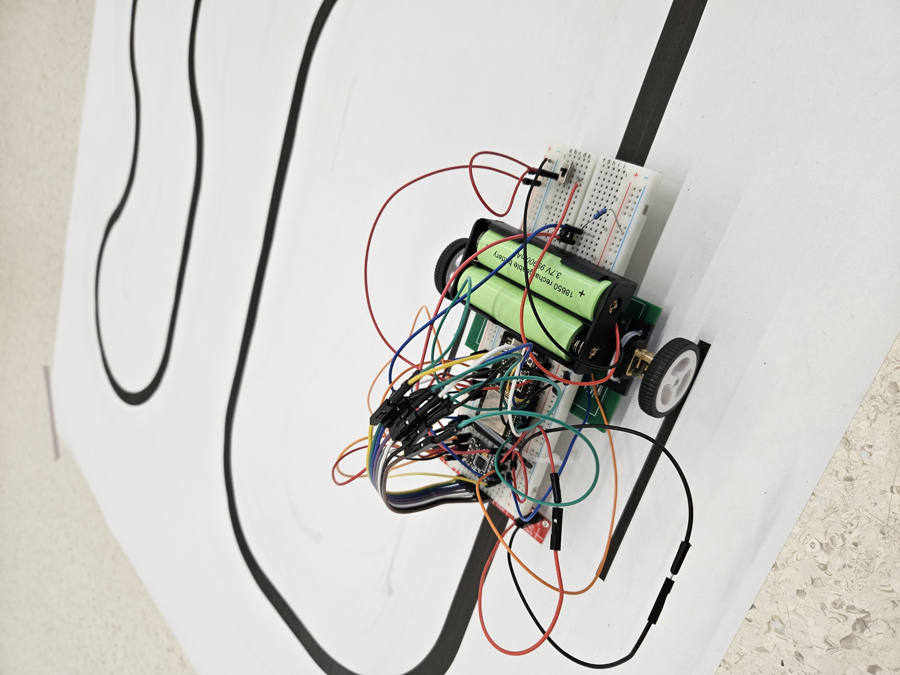

# LineFollower

lege repository die je als template kan gebruiken om een eigen repository te starten voor uw linefollower project

  
## specifications

microcontroller:

motors: 

h-bridge:

sensors:

batteries:

wireless communication:

distance sensor - motors:

weight:

speed: 

